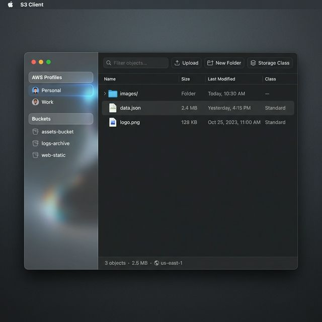
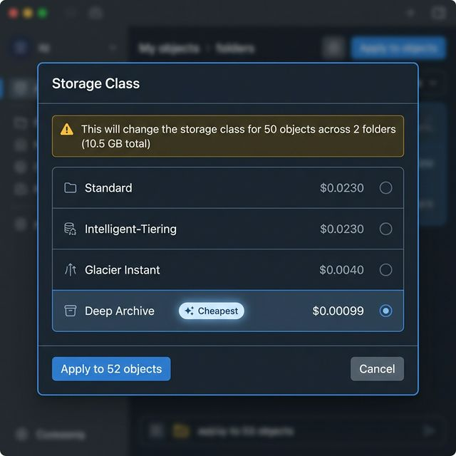

# S3 Client — Next Gen
### Fully Designed & Engineered by AI



**S3 Client** is a modern, high-performance desktop application for managing AWS S3 buckets. It features a stunning dark-mode interface, glassmorphism aesthetics, and a robust set of tools for power users.

> **Note**: This entire application—including the architecture, code, design system, and this document—was generated by an AI Agent.

## ✨ Key Features

- **Modern UX**: A clean, responsive interface built with React and polished with a custom CSS design system.
- **Cross-Platform**: optimized builds for **macOS**, **Windows**, and **Linux** via Electron.
- **Advanced S3 Tools**:
  - **Recursive Storage Class Optimization**: Change storage classes for entire folders with one click.
  - **Cost Analysis**: Automatic cost comparison for storage classes (Standard, Intelligent-Tiering, Glacier, etc.).
  - **Multi-Profile Support**: Seamlessly switch between AWS profiles/roles.

## 📸 Visuals

### Intelligent Storage Optimization
We built a sophisticated dialog to help you save money on S3 costs. It recursively analyzes folder contents, calculates potential savings, and warns you about object counts before applying changes.



## 🏗 Architecture

- **Frontend**: React 19, TypeScript, Vite
- **Backend**: Electron (Main Process), AWS SDK v3
- **Build System**: Electron Builder + GitHub Actions

## 🚀 Automated CI/CD

This repository includes a robust GitHub Actions workflow that automatically builds and publishes binaries for all major platforms on every release.

```yaml
# .github/workflows/build.yml
jobs:
  build:
    strategy:
      matrix:
        os: [macos-latest, ubuntu-latest, windows-latest]
```

---

_Generated with ❤️ by Google DeepMind's Antigravity Agent_
